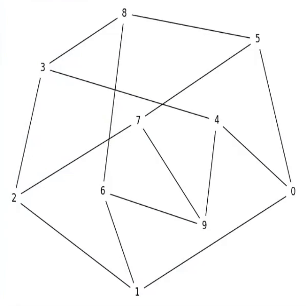
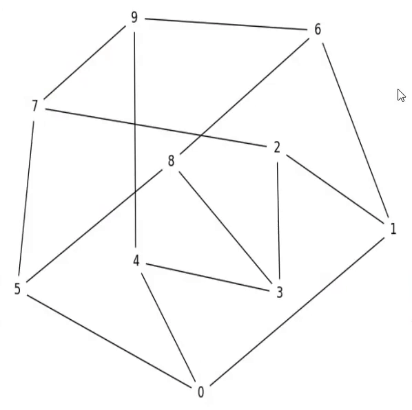
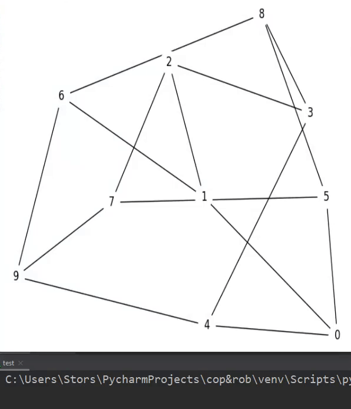

# Cop-Robbers-Gym
An openai gym that allows agent to catch bad guys and bad guys to escape from the long arm of the law.

# What is provided in this gym?

## Controllers:

Basic controllers are useful when one only wants to train one of the sides of this problem. A naive controller for both 
the robber and the cops is provided. Notice that even though its decision rules are fairly simple, it still offers adequate
performance. Here are a few examples on the Petersen graph (which is of cop number 3):

With one cop:

With two cops:
 

With three cops:

# Related work

Cops&robbers has been extensively studied in graph theory. However, we are still very far from any algorithm, even an NP complete one, that could inform us on the "cop-win-ness" of any graph. 

https://www.researchgate.net/publication/317309149_Linguistic_Geometry_Approach_for_Solving_the_Cops_and_Robber_Problem_in_Grid_Environments 

https://www.google.com/url?sa=t&source=web&rct=j&url=http://webdocs.cs.ualberta.ca/~nathanst/papers/TrailMax.pdf&ved=2ahUKEwi_3c3F_vHrAhVxk-AKHVhlCHsQFjAEegQIBBAB&usg=AOvVaw0MEzu6bxMoV1wrA0PC2zC3&cshid=1600407784378
